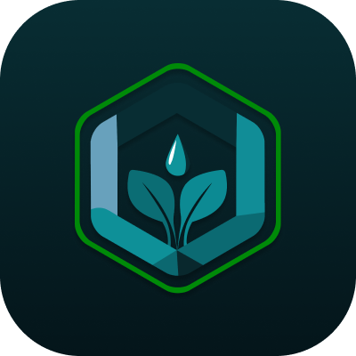
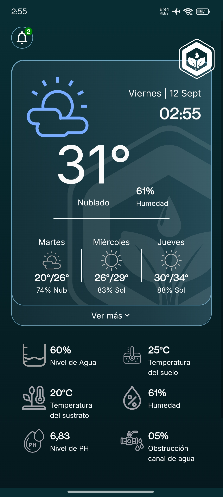
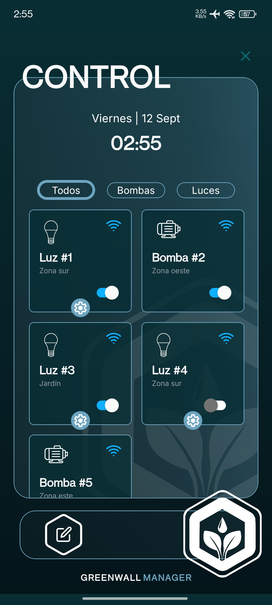
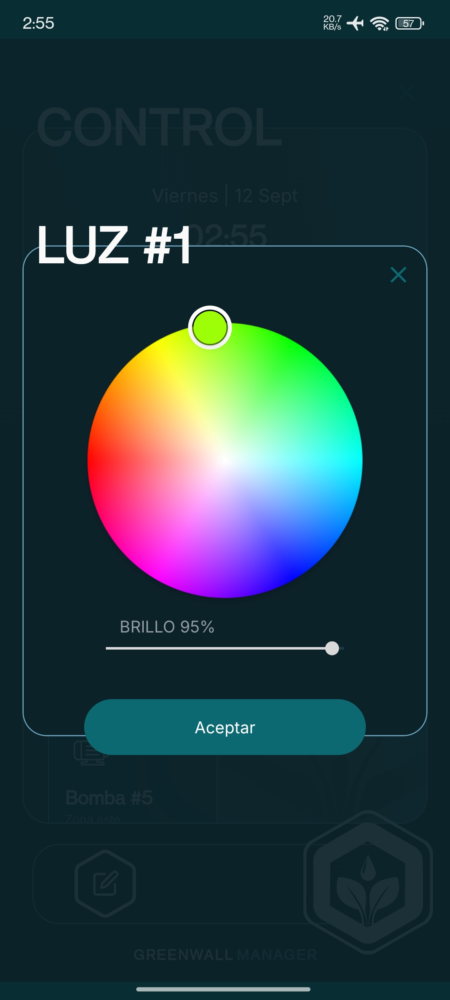
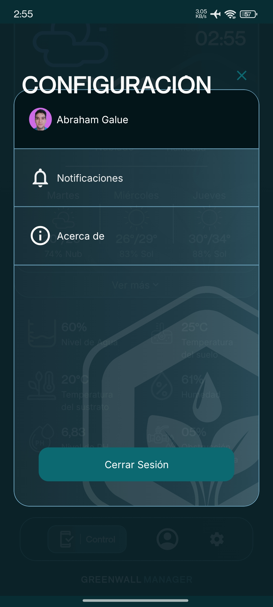

<div align='center'>

# Green Wall Manager 🌳

</div>

<p align="center">
  
</p>

<p align="center">
  
  
  
  
</p>

<p align="center">
    <a href="https://github.com/abrahamgalue/proyecto-tesis/releases/latest">
        
    </a>
    <a href="https://github.com/abrahamgalue/proyecto-tesis/releases">
        
    </a>
</p>

**Green Wall Manager** is a modern indoor garden app for mobile, built with Expo. It's designed to make monitoring and controlling lights, pumps, weather, and notifications simple and seamless.

## ✨ Core Features

- **Weather Dashboard**: Current conditions, forecasts, and helpful alerts.
- **Device Control**: Manage lights and pumps with real-time status and quick actions.
- **Notifications**: Stay informed about weather changes and device events.
- **Authentication & Account**: Sign in securely and manage your profile.
- **Settings**: Customize preferences and app behavior.
- **Modern UI**: Clean, responsive design with smooth animations and dark/light modes.
- **Cross-Platform**: Works on Android, iOS, and the web with Expo.

## 🛠️ Tech Stack & Architecture

- **Language**: TypeScript + JavaScript with [Expo](https://expo.dev/) and [React Native](https://reactnative.dev/) for cross‑platform development.
- **Navigation**: [Expo Router](https://docs.expo.dev/versions/latest/sdk/router/) for file‑based navigation and deep linking.
- **State**: [Zustand](https://zustand.docs.pmnd.rs/getting-started/introduction) with persistence via [AsyncStorage](https://react-native-async-storage.github.io/async-storage/) for lightweight global state.
- **Forms/Validation**: [React Hook Form](https://react-hook-form.com/) + [Zod](https://zod.dev/) for type‑safe forms and schema validation.
- **Data Fetching**: [TanStack Query](https://tanstack.com/query/latest) for caching, background refetching, and mutation management.
- **Auth**: [Supabase](https://supabase.com/) for authentication and backend data services.
- **UI**: [NativeWind](https://www.nativewind.dev/) / [Tailwind CSS](https://tailwindcss.com/) for utility‑first styling and theme support (dark/light).
- **Images**: [expo-image](https://docs.expo.dev/versions/latest/sdk/image/) for performant, cached image rendering.
- **Animations**: [React Native Reanimated](https://docs.swmansion.com/react-native-reanimated/) for smooth, native‑driven animations and gestures.
- **Testing**: [Jest](https://jestjs.io/) + [Testing Library for React Native](https://callstack.github.io/react-native-testing-library/index) for unit and UI tests.
- **Bundler**: [Metro](https://metrobundler.dev/) for fast development builds and transforms.

## 🚀 Getting Started

To get a local copy up and running, follow these simple steps.

### Prerequisites

- Node.js LTS.
- Node package manager installed: npm, pnpm, yarn or bun (I use bun for the examples).
- For device/simulator:
  - Android Studio (SDK 34+) or Xcode (for iOS simulators).
  - Expo Go or a custom dev client.

### Installation

1. Clone the repo

   ```sh
   git clone https://github.com/abrahamgalue/proyecto-tesis.git
   cd proyecto-tesis
   ```

2. Install dependencies

   ```sh
   bun install
   ```

3. Configure environment variables

   - Copy `.env.example` to `.env` and set Supabase vars, or edit [data/env/client.ts](data/env/client.ts) defaults.

   ```sh
   cp .env.example .env
   # then edit .env
   ```

4. Start the app

   Dev menu:

   ```sh
   bunx expo start
   # or
   bun start
   ```

   Web:

   ```sh
   bun run web
   ```

   Android:

   ```sh
   bun run android
   ```

   iOS:

   ```sh
   bun run ios
   ```

## 📦 Environment

Set your environment variables (Supabase) using [data/env/client.ts](data/env/client.ts). You can start from `.env.example`:

```sh
# .env
EXPO_PUBLIC_API_URL=YOUR_REACT_NATIVE_SUPABASE_URL
EXPO_PUBLIC_API_KEY=YOUR_REACT_NATIVE_SUPABASE_ANON_KEY
```

The app consumes these via [config/supabase.ts](config/supabase.ts).

## 🧪 Testing

Run all tests (watch mode):

```sh
bun test
```

Debug tests (failed/changed only):

```sh
bun run testDebug
```

Final CI-like run:

```sh
bun run testFinal
```

Notes:

- Jest configuration lives in [package.json](package.json) (`jest` key).
- Tests are under [**tests**/](__tests__/).
- React Native Testing Library is used for component tests.
- Mocks exist in [**mocks**/](__mocks__/).

## 🎨 Linting, Formatting & Colors

Lint:

```sh
bun run lint
```

Lint and fix:

```sh
bun run lint:fix
```

Generate design tokens (colors) and auto-fix generated file:

```sh
bun run generate-colors
```

Output is written to [constants/generatedColors.ts](constants/generatedColors.ts). Tailwind tokens are configured in [tailwind.config.js](tailwind.config.js).

## 📂 Project Structure

```
app/                       # Routes and layouts
components/                # Shared UI and primitives (buttons, icons, card, images)
features/                  # Feature modules (weather, devices, settings, account, auth)
services/                  # API/service logic (e.g., weather)
store/                     # Zustand stores (devices, account, notifications, etc.)
config/                    # App configs (e.g., Supabase)
constants/                 # Color tokens and generated colors
lib/                       # Utilities and formatters
__tests__/                 # Jest tests
assets/                    # Images and fonts (see assets/preview/*)
```

## 📝 License

See [LICENSE](LICENSE).
